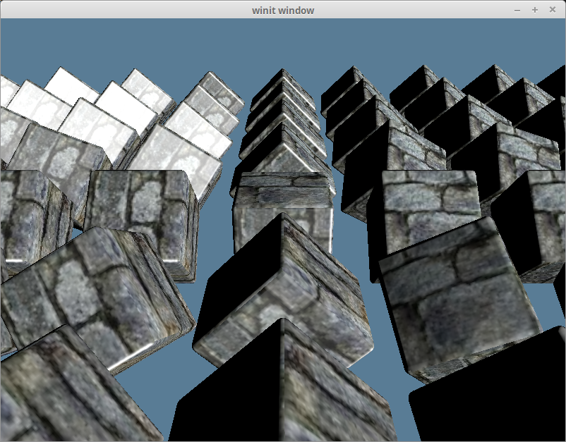
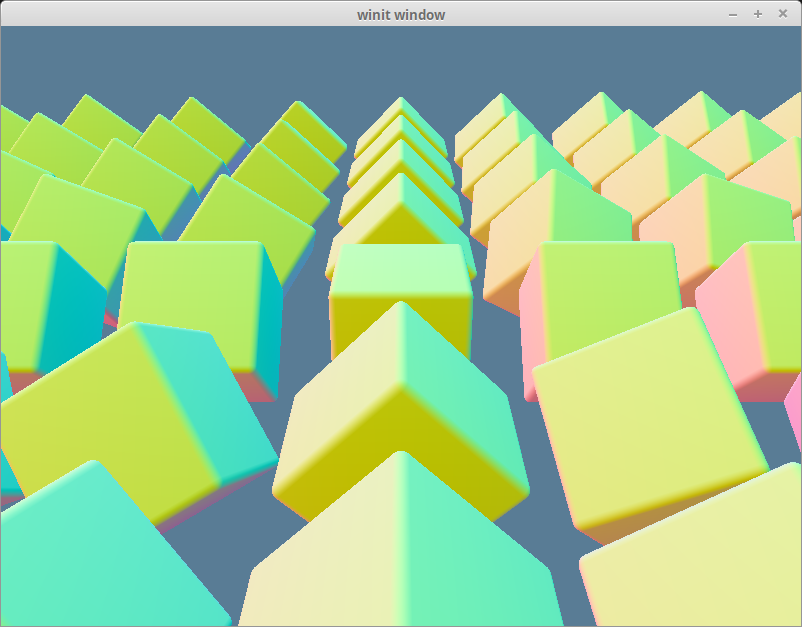

# Normal Mapping

Adding lighting really made our scene look more real, but there's still a problem. Our cubes look really smooth. The brick texture looks like it was painted on.



Remember from [last time](../tutorial10-lighting) we did some math using our models normals. Our model is very simple, so we don't have a lot of normals to work with. We could fix this by adding more geometry to our mesh, but that would make our game run slower. You may remember that our cube model includes a texture that not using: a normal map. This is how we're going to get more data for our lighting calculation to work with. First, let's take a look at our normal map.


This may look like just a bluish texture, but our normals are hiding in there. How it works is the x, y, and z components of the normal are stored in the r, g, and b components respectively. This is what our scene would look like if we look at just the normals.



Lets add the normal texture to our pipeline, and use it instead of the normal from the vertex shader. We're going to have to modify the material loading code in `Model`.

```rust
let diffuse_path = mat.diffuse_texture;
let (diffuse_texture, cmds) = texture::Texture::load(&device, containing_folder.join(diffuse_path))?;
command_buffers.push(cmds); // NEW!

// NEW!
let normal_path = match mat.normal_texture.as_str() {
    "" => {
        // Different modeling software can store objs differently, so tobj stores material parameters
        // it's not familiar with in a HashMap
        &mat.unknown_param["map_Bump"]
    }
    path => path,
};
let (normal_texture, cmds) = texture::Texture::load(&device, containing_folder.join(normal_path))?;
command_buffers.push(cmds);
```

We also need to make sure we're adding *both* sets of `cmds` to the `command_buffers` `Vec`, otherwise the one of the textures will be black. Also be sure to remove the push at the bottom of the loop.

We'll have to modify the materials bind_group as well to specify the new texture.

```rust
let bind_group = device.create_bind_group(&wgpu::BindGroupDescriptor {
    layout,
    bindings: &[
        wgpu::Binding {
            binding: 0,
            resource: wgpu::BindingResource::TextureView(&diffuse_texture.view),
        },
        wgpu::Binding {
            binding: 1,
            resource: wgpu::BindingResource::Sampler(&diffuse_texture.sampler),
        },
        // Normal map bindings
        wgpu::Binding {
            binding: 2,
            resource: wgpu::BindingResource::TextureView(&normal_texture.view),
        },
        wgpu::Binding {
            binding: 3,
            resource: wgpu::BindingResource::Sampler(&normal_texture.sampler),
        },
    ]
});
```

We'll add a field to `Material` as well.

```rust
pub struct Material {
    pub name: String,
    pub diffuse_texture: texture::Texture,
    pub normal_texture: texture::Texture, // NEW!
    pub bind_group: wgpu::BindGroup,
}

// in Model::load()
materials.push(Material {
    name: mat.name,
    diffuse_texture,
    normal_texture, // NEW!
    bind_group,
});
```

We need to update the `texture_bind_group_layout` in `State::new()` otherwise our program will crash when we try to run it.

```rust
let texture_bind_group_layout = device.create_bind_group_layout(&wgpu::BindGroupLayoutDescriptor {
    bindings: &[
        wgpu::BindGroupLayoutBinding {
            binding: 0,
            visibility: wgpu::ShaderStage::FRAGMENT,
            ty: wgpu::BindingType::SampledTexture {
                multisampled: false,
                dimension: wgpu::TextureViewDimension::D2,
            },
        },
        wgpu::BindGroupLayoutBinding {
            binding: 1,
            visibility: wgpu::ShaderStage::FRAGMENT,
            ty: wgpu::BindingType::Sampler,
        },
        // NEW!
        wgpu::BindGroupLayoutBinding {
            binding: 2,
            visibility: wgpu::ShaderStage::FRAGMENT,
            ty: wgpu::BindingType::SampledTexture {
                multisampled: false,
                dimension: wgpu::TextureViewDimension::D2,
            },
        },
        wgpu::BindGroupLayoutBinding {
            binding: 3,
            visibility: wgpu::ShaderStage::FRAGMENT,
            ty: wgpu::BindingType::Sampler,
        },
    ],
});
```

Now we get to the new shader code.
